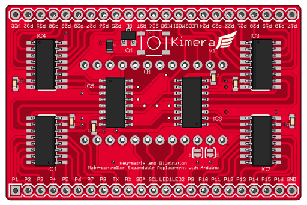

Kimera使用手册（中文版）
======

## 写在前面

### 为什么要做Kimera

在我开发其他键盘固件的过程中，听到了许多希望我做一款方便DIY的键盘主控的声音，于是就有了Kimera。

### Kimera适合哪些人

* 想DIY键盘的人
    * 完全通过飞线DIY键盘的人。
    * 会画键盘矩阵但是对主控不太熟悉的人。
* 想复活手中主控坏掉了的键盘或没有主控的轴板的人。
* 觉得手中键盘的功能不够强大想换掉主控的人。
* 还在怀念Aikon、Monkey、变色龙等等的人。

## 简介

Kimera是由本人（kai1103）设计开发的一款键盘主控套件。

为了方便广大爱好者DIY，Kimera选用Arduino Pro Micro (Sparkfun Pro Micro)开发板作为主控制器模块，并且所有外围元件皆为SOP封装，一定程度上兼顾了尺寸与DIY难易度。

Kimera提供了32个键盘IO引脚，可以驱动最大8x24、16x16、24x8等尺寸的键盘矩阵，几乎可以满足市面上所有常见键盘布局的需求。

此外Kimera还提供了背光功能和LED指示灯的支持，并且具有丰富的扩展接口，方便大家DIY以及后续的功能扩展。

Kimera还允许用户通过直观的GUI程序自定义所有按键的功能，打造最符合用户使用习惯，只属于用户自己的DIY键盘。

## 硬件参数

### 概要



<!--
```
   46   45   44   43   42   41   40   39   38   37   36   35   34   33   32   31   30   29   28   27   26   25   24
,-------------------------------------------------------------------------------------------------------------------.
|  *    *    *    *    *    *    *    *    *    *    *    *    *    *    *    *    *    *    *    *    *    *    *  |
| VCC  P32  P31  P30  P29  P28  P27  P26  P25   BL  RST  SCK  MISO MOSI LED3 P24  P23  P22  P21  P20  P19  P18  P17 |
|                                               |      ,-----.                                                      |
|                                             +---+  --| ,-. |--                                  IC3               |
|           ,--v--.                      ++   +---+    | | | |                                    ,--v--.           |
|         --|     |--                    ||    | |   --| `-' |--                                --|     |--         |
|         --|     |--                    ++    Q1      `-----'                                  --|     |--         |
|         --|     |--                                    S1                                     --|     |--         |
|         --|     |--                                                                           --|     |--         |
|         --|     |--        *    *    *    *    *    *    *    *    *    *    *    *           --|     |--         |
|         --|     |--                                   U1                     ++               --|     |--         |
|    ++   --|     |--                 ,--v--.                        ,-----.   ||            ++ --|     |--         |
|    ||   --|     |--          IC5  --|     |--                    --|     |-- ++            || --|     |--         |
|    ++     `-----'                 --|     |--                    --|     |--               ++   `-----'           |
|                                   --|     |--                    --|     |--                                      |
|                                   --|     |--                    --|     |--                                      |
|                                   --|     |--                    --|     |--                                      |
|                                   --|     |--                    --|     |--                                      |
|           ,-----.   ++            --|     |--                    --|     |--  IC6               ,-----.     ++    |
|         --|     |-- ||         ++ --|     |--                    --|     |--                  --|     |--   ||    |
|         --|     |-- ++         ||   `-----'                        `--^--'                    --|     |--   ++    |
|         --|     |--            ++                                                             --|     |--         |
|         --|     |--        *    *    *    *    *    *    *    *    *    *    *    *           --|     |--         |
|         --|     |--                                                                           --|     |--         |
|         --|     |--                                                    ++   ++                --|     |--         |
|         --|     |--                                                    ++   ++                --|     |--         |
|         --|     |--                                                    SJ1  SJ2               --|     |--         |
|           `--^--'                                                                               `--^--'           |
|               IC1                                                                                   IC2           |
|                                                                                                                   |
|  P1   P2   P3   P4   P5   P6   P7   P8   TX   RX  SDA  SCL  LED1 LED2  P9  P10  P11  P12  P13  P14  P15  P16  GND |
|  #    *    *    *    *    *    *    *    *    *    *    *    *    *    *    *    *    *    *    *    *    *    *  |
`-------------------------------------------------------------------------------------------------------------------'
   1    2    3    4    5    6    7    8    9    10   11   12   13   14   15   16   17   18   19   20   21   22   23
```
-->

| 项目     | 规格 |
| -------- | ---- |
| 尺寸     | 59.6mm x 39.4mm x 1mm （仅PCB） |
| 微控制器 | Atmel ATmega32u4 |
| USB接口  | 标准Micro-B（母头） |
| IO接口   | 2排1x23排针，共46针。间距2.54mm，行间距35.5mm（刚好跨过两行轴，方便安装在自定义轴板的背部）。 |

### 引脚定义

```
     ,---------------.
  1 -| P1    v   VCC |- 46
  2 -| P2        P32 |- 45
  3 -| P3        P31 |- 44
  4 -| P4        P30 |- 43
  5 -| P5        P29 |- 42
  6 -| P6        P28 |- 42
  7 -| P7        P27 |- 40
  8 -| P8        P26 |- 39
  9 -| TX        P25 |- 38
 10 -| RX         BL |- 37
 11 -| SDA       RST |- 36
 12 -| SCL       SCK |- 35
 13 -| LED1     MISO |- 34
 14 -| LED2     MOSI |- 33
 15 -| P9       LED3 |- 32
 16 -| P10       P24 |- 31
 17 -| P11       P23 |- 30
 18 -| P12       P22 |- 29
 19 -| P13       P21 |- 28
 20 -| P14       P20 |- 27
 21 -| P15       P19 |- 26
 22 -| P16       P18 |- 25
 23 -| GND       P17 |- 24
     `---------------'
```
| 引脚          | 功能 |
| ------------- | ---- |
| VCC           | 电源。配合Pro Micro 5V/16MHz版本使用时电位约为5V，配合Pro Micro 3.3V/8MHz版本使用时电位约为3.3V。|
| GND           | 接地。电位约为0V。|
| RST           | 复位。低有效。|
| P1-P32        | 用于驱动键盘矩阵。8个一组，共4组。（注意：请不要将P1-P32直接与VCC或GND接通）|
| BL            |  用于背光（<b>B</b>ack<b>l</b>ight）控制。可支持最大800mA瞬时电流。|
| LED1-LED3     | 用于驱动LED指示灯。通常用作指示Caps Lock、Scroll Lock以及Num Lock等的状态。|
| TX/RX         | UART接口。扩展用。|
| SDA/SCL       | I<sup>2</sup>C接口。扩展用。|
| MOSI/MISO/SCK | SPI接口。扩展用。|

## 软件参数

### 功能

* 标准HID键盘
* 基本按键
* 鼠标键
* 多媒体键
* 全键自定义
* 自定义多层布局（最多3层）
* 自定义功能键（最多32个）
* USB Boot模式（BIOS下可用）
* USB N-Key Rollover（USB全键无冲）
* [Magic Command](https://github.com/tmk/tmk_keyboard#magic-commands)
* [Boot Magic](https://github.com/tmk/tmk_keyboard#boot-magic-configuration---virtual-dip-switch)
* 三级背光（不同亮度）
* 三级呼吸灯（不同速度）

## 硬件连接

### 按键矩阵

### 背光

### LED

### 其他

## 软件配置

## 感谢

特别感谢Leon同学协助测试和起草文档。
